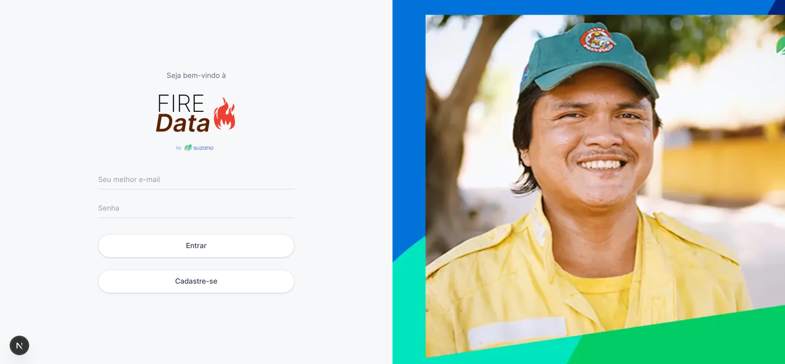

# Testes de Usabilidade - FireData

## 1. Tela(s) analisada(s)

Tela de entrada do sistema **FireData** (by Suzano), utilizada pelos operadores das centrais de
monitoramento de incêndios florestais para acessar a plataforma. Contém campos de e-mail e
senha, além de opção de cadastro.

---

## 2. Tipo de teste

**Tipo:** Tarefa

Será testada a capacidade do usuário de **realizar o login com sucesso** na plataforma FireData,
partindo do zero - sem instrução prévia sobre o fluxo - para identificar se a interface comunica
com clareza o que deve ser feito e em que ordem.

---

## 3. Conjunto de perguntas (técnica do funil)

1. **(Ampla)** Ao olhar para essa tela pela primeira vez, o que você entende que esse sistema faz e para quem ele é destinado?
2. **(Intermediária)** O que você faria agora para entrar no sistema? Por onde você começaria?
3. **(Intermediária)** Você encontrou alguma dificuldade para identificar onde inserir suas credenciais? O que chamou sua atenção primeiro?
4. **(Específica)** O que você entende pela diferença entre os botões "Entrar" e "Cadastre-se"? Você sabe qual usar?
5. **(Específica)** Se você errasse a senha, o que você esperaria que acontecesse? Você vê alguma indicação de como proceder nesse caso?

---

## 4. Objetivo do teste

Descobrir se um operador de central de monitoramento (usuário real do sistema) consegue
compreender o propósito da tela e executar o login de forma autônoma, sem ambiguidades ou
necessidade de suporte externo.

---

## 5. Ação ou entendimento esperado

O usuário deve ser capaz de identificar os campos de credenciais, preenchê-los corretamente e
acionar o botão "Entrar" sem hesitação. Espera-se também que compreenda que "Cadastre-se"
é um fluxo alternativo para novos usuários, não uma etapa obrigatória do login.